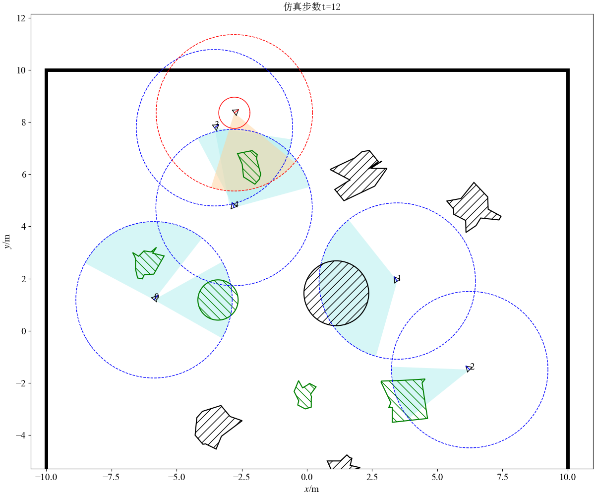

# Cooperative_Hunting
这是我在2020-2021年用python语言设计的群机器人的协同围捕的仿真工程。

## I. 描述

- 项目简介：本项目考虑的围捕任务是在有边界的场地中，有个机器人、个固定障碍物、个固定障碍物、个可旋转不规则障碍物、个移动可旋转不规则障碍物、1个目标，机器人群需要在该场地中避开障碍物并完成对目标的围捕，最终对目标形成以目标为圆心，以给定值为半径的圆形包围圈。
- 关键思路：机器人和目标均采用unicycle模型作为运动学模型，本项目主要设计的是机器人的控制输入、。
- 描述结果：机器人群需要在该场地中避开障碍物并完成对目标的围捕，最终对目标形成以目标为圆心，以给定值为半径的圆形包围圈。全过程使用matplotlib画图逐帧展示，同时也能输出视频和机器人、目标的位置变化。

## II. 使用方法

1. 环境、软件、特殊的依赖及其版本详细说明

- 环境： `Windows 10` 
- 软件：`Python 3.7`或更新版
- python依赖包：`numpy`、`yaml`、`matplotlib`、`numba`、`opencv-python`

python依赖包可以通过以下方式安装：

在`cmd`中输入

```bash
pip install XXX
```

XXX为`numpy`、`yaml`、`matplotlib`、`numba`、`opencv-python`等包。

2. 本项目只需将文件夹下载，在`cmd`中输入

```bash
python3 run.py
```

即可运行。

3. 本项目成功运行的结果：



出现以上界面并且画面正常刷新，即说明项目成功运行。

预期的图片在`./example/Figure_1.png`中，预期视频在`./output/2021_04_22.mp4`，输出数据文件的保存方式为txt，存储路径为`./output`。